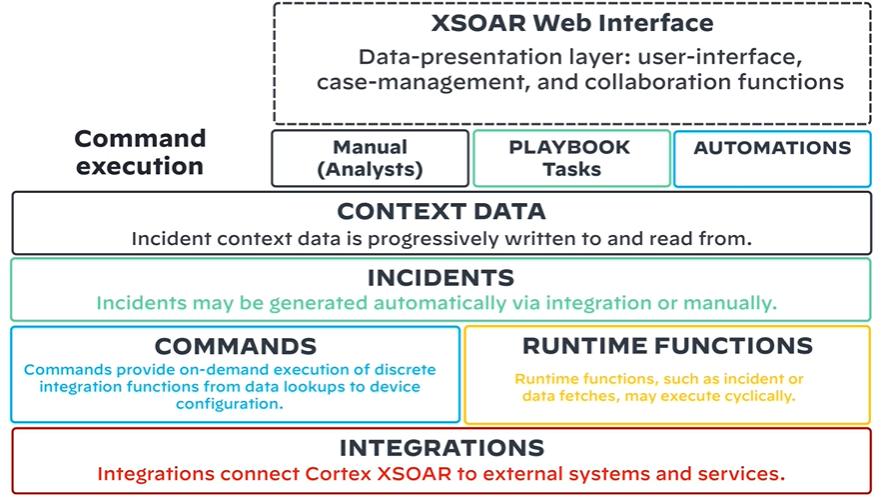

# Integration concepts

* For configuring go to: `Settings > Integrations > Servers & Services`
* `Runtime functions` such as incident or data fetches
* `Commands` provide on-demand execution of functions. Can be triggered manually or through playbooks
* `Incidents` may be generated automatically via integration or manually
* `Context data` of incidents is stored in its own json formated store
    > Subsequent actions may be taken from this context data file
* `Marketplace` can be used to get specific integrations with services (e.g. Azure) and by clicking `Add Instance` once found
* `Integrations` can also be manually coded in python
### Types of integrations
* System Admin - e.g. authentication services and directory lookups
* Event Ingestion - e.g. SIEMs, mailboxes to which users send phishing emails
* Enrichment - e.g. checking data from an incident such as IP address info
* Response and Remediation - action to handle an incident

# Use Cases (Incident types)
* In the context of the XSOAR Marketplace, use cases are categorized by use of over a dozen simply titled headings, including Hunting, Phishing, Malware, Ransomware, and Threat Intelligence Management.
* In the context of XSOAR engineer it is equivalent with high level design specification for data fields, playbook, automations etc.
> Mappings of use cases in XSOAR:
> `Use case` -> `XSOAR Incident type` -> `Layout and/or playbook`
>
> Engineering process:
> * Identify 3-5 use cases for your org (eg. Phishing, Password reset)
> * Identify the owners
> * Define and assign roles and responsibilities
> * Get everyone involved

