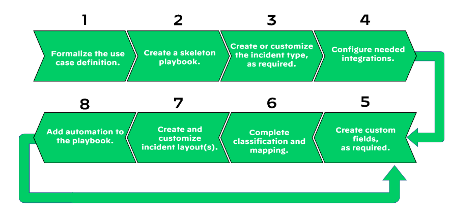
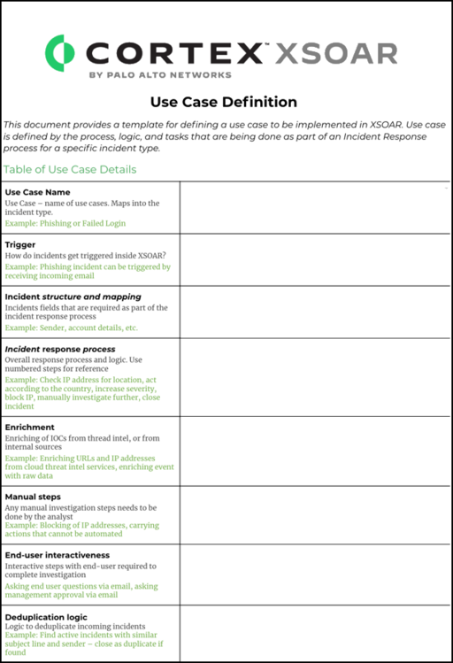

# Playbook dev process

1. Formalize case template for describing workflows, tools and desired outcomes.
2. Based on info from step 1, you can create or copy and modify a playbook with a sequence of placeholder tasks.
3. Create or customise incident type
4. Add nedded integrations
5. Incident fields are placeholders which can be populated with data from an incoming incident. These include third party integrations.
6. Classification determines the type of incident created.
7. Incident information is highly customizable.
8. Finalizating the playbook it can be automated and refined as more info is discovered.

# Resources for XSOAR Engineers
> The meaning of the term “use case” may vary from situation to situation. A use case can be defined as "a description or concept of the workflow, tools, and desired outcomes that are associated with a type of incident or other narrowly defined situation." A use case can also be defined as “a design specification for a custom playbook or deployment.”

### `Example of use case definition document`

# Playboook functions
Playbooks do not have to include many (or any) automated steps to be valuable and successful. Cortex XSOAR playbooks support manual and automated processes.

Playbook development interface allows you to select from several task types: 
* `Section headers` provide a way to group and label a playbook's functional sections.
* `Standard tasks` The standard task type includes both manual and script-based (automation-based) tasks.
* `Conditional tasks` might loop through system information or incident data and execute only if the specified condition is met. You use them to create decision points or logical branches in a playbook.
* `Automated tasks` can perform a virtually unlimited scope of functions, including open tickets in a ticketing system or send a file to a sandbox with detonation instructions.
* `Data collection tasks` interact with users through a web-hosted, task-specified, custom survey page. All responses are collected and recorded in the incident's context data.

You can add sub-playbook which interact with each other.