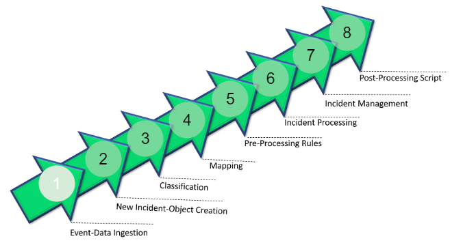
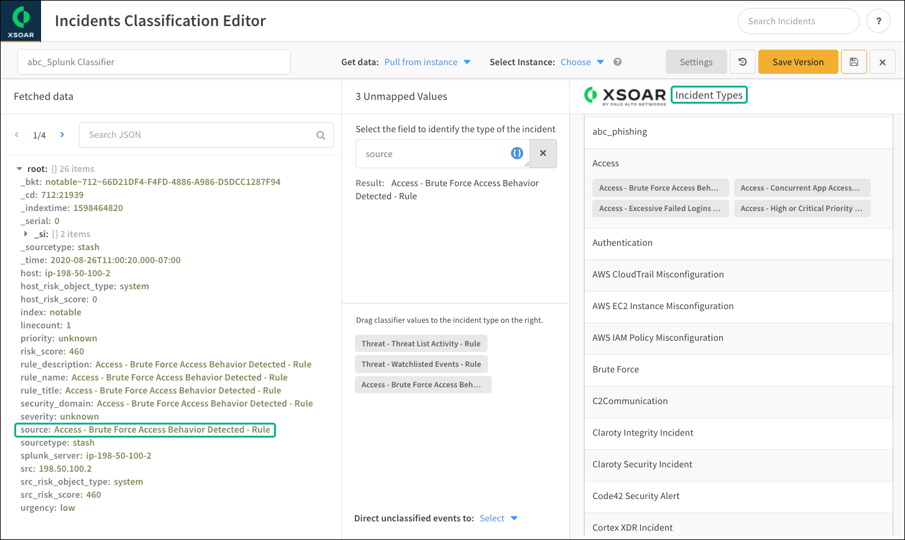

# Integrations and Incidents

* An external event becomes a Cortex XSOAR incident after the system creates an incident-object, 
* populates the incident-object with the raw event data, 
* generates various types of profile data specific to Cortex XSOAR, 
* runs any applicable “pre-processing” rules for filtering the incident type, 
* and associates various configuration parameters with the new incident. 
* Only after the new incident is fully instantiated is the incident ready for Playbook processing, analyst review, and other incident-management activity.

Pre-processing actions: `close, drop, drop and update, link, link and close, and run a script`, it can also deduplicate event data and discard event data that should not be processed.

Classification and mapping applies only to those integrations that fetch incidents.
`Content packs` typically include ready-to-use classifier and mapper objects.

You can generate test incidents with the integration (content) pack

# Classification and Mapping

`Settings > Integrations > Classification & Mapping` to access classifiers and mappers.
Classification enables you to select one key in the source data object and map multiple possible values for that key and enables you to specify a default incident type.

 Mapping editor is UI based and maps JSON style objects to custom field values.

 Incident data can be 1-to-1 mapped to a type or to multiple ones, with 1-to-1 there is no need for a classifier.

Classsiffiers and mappers show under the same screen.

# Incident and Filed Mapping

The mapping of event data to Cortex XSOAR fields enables the system to present and manage contextually relevant data for analyst-oriented page layouts, widgets, and reports. 

To map:
1. Set the "Get data" option to load sample event data from an integration instance or from an uploaded JSON file.
2. For the field that you want to map, click `Choose data path`.
3. Manualy enter the key or select one from the target value to map to.