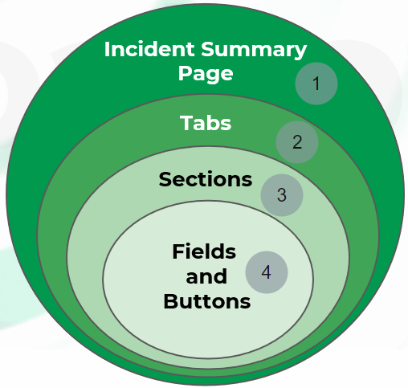

# Incident Management
Process for creating incidents:
1. Incident creation (via integration)
2. War room activity (for analyst colaboration)
3. Evidence marking (When analysts mark war room items as important)
4. Playbook completion
5. Incident closure

Layout configurations are highly customizable. Therefore, it is useful to review exactly how to specify the layout configuration that Cortex XSOAR will apply to a particular type of incident.

The Incident Summary page contains the incident’s War Room and Work Plan. The incident's Work Plan contains the incident’s Playbook.

# Layout Builder Components

# Roles and Permissions
All of the tabs on the Incident Summary page include a Viewing Permissions setting. The Viewing Permissions setting enables you to add one or more RBAC (role-based access controls) roles to the configuration to restrict viewing privileges for the tab to user accounts to which the selected roles are likewise assigned. You can add multiple roles to a single user and you can nest roles within roles.