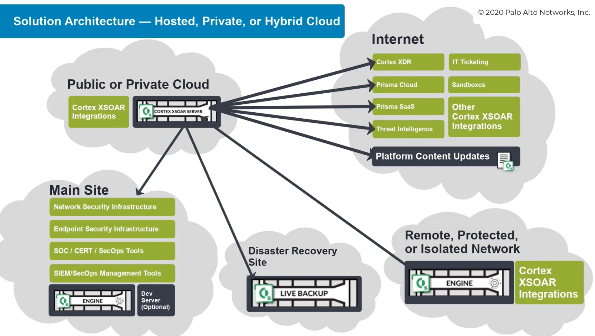
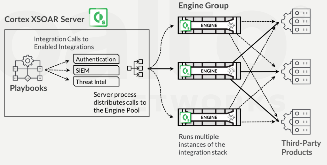
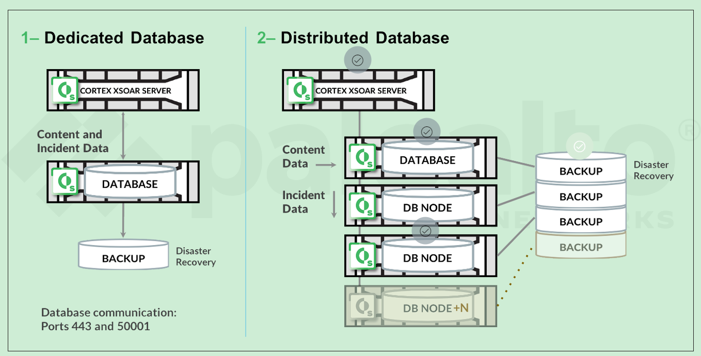

# Solution Components
The Cortex XSOAR Server provides a centralized server function for all system operations. The server includes a database that stores incident data.

The following features are supported on the server:
- Content updates (playbooks, automations etc.)
- Cortex engine, for local execution of integration-level tasks on isolated networks
- Live backup server (DR purposes)
- Dedicated db servers
- Dev server (for testing and acceptance)
- Mobile app for accessing the dashboard and war room functions

# Scalability Support

Two types of scalability support: 
- for multiple engines 

- and for dedicated and distributed databases.
